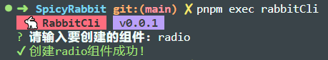

# SpicyRabbit UI


A UI Component Library Based on Vue3 and Typescript

## 🚀 Install | 安装

> we recommend that you use pnpm for installation.

Use `pnpm` install

```shell
pnpm add @spicyrabbit/ui -S
```

Use `yarn` install

```shell
yarn add @spicyrabbit/ui
```

Use `npm` install

```shell
npm install @spicyrabbit/ui -S
```

## ⚡ Quick Start | 快速开始

> we used vue@3.3.4 when developing this library, Due to some breaking changes in type definition of vue, if you want have code intelligence, you should upgrade your vue version to 3.3.4.

```typescript
import { createApp } from 'vue'
import './style.css'

import Rabbit from '@spicyrabbit/ui'
import "@spicyrabbit/ui/theme/index.css"

import App from './App.vue'
createApp(App).use(Rabbit).mount('#app')
```

## ⚡ Quick experience | 快速体验

```html
<template>
    <MtButton></Mtbutton>
</template>
```

## 🤡 Performance | 性能

目前开发效果优先，在动效上使用了gsap做辅助，后期会逐步迁移到自己的动效库之上

## 🍖 Development | 开发

当你fork源码并克隆到本地进行开发的时候，本项目提供了自动化组件创建工具 `RabbitCli`用来简化整个开发流程。

你可以在项目的任何位置运行 `pnpm exec rabbitCli` 或者 `pnpm run -w create`进行创建组件



## Website | 预览站点
- [国内站点-测试版](http://47.98.20.229/)
- [国外站点-正式版](https://spicy-rabbit-docs.vercel.app/)
- [国外站点-测试版](https://spicy-rabbit-docs-git-dev-metakirobot-gmailcom.vercel.app/)